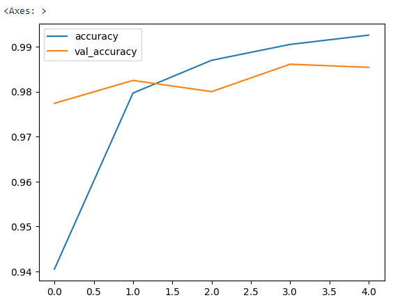
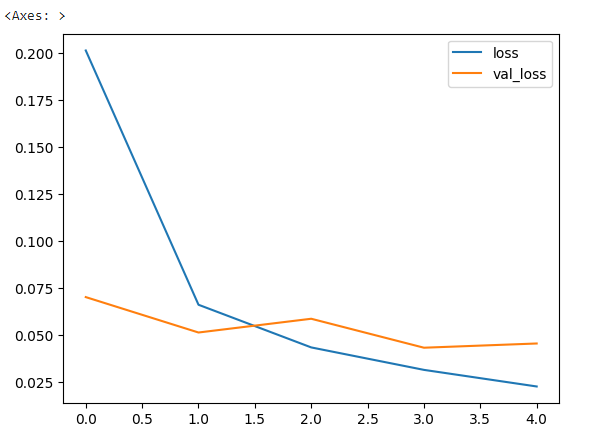
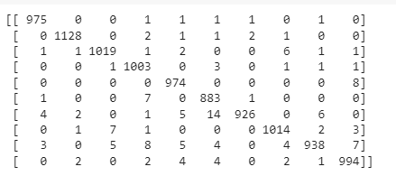
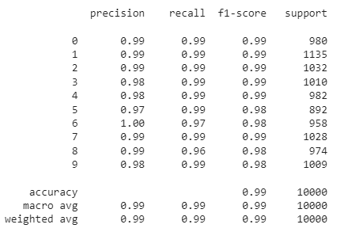
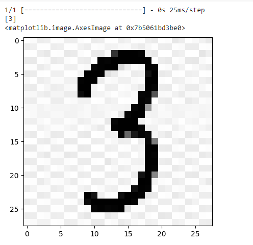

# Convolutional Deep Neural Network for Digit Classification

## AIM

To Develop a convolutional deep neural network for digit classification and to verify the response for scanned handwritten images.

## Problem Statement and Dataset

## Neural Network Model


## DESIGN STEPS

### Step 1: 
Import the required packages
### Step 2:
Load the dataset
### Step 3:
Scale the dataset
### Step 4:
Use the one-hot encoder
### Step 5:
Create the model
### Step 6:
Compile the model
### Step 7:
Fit the model
### Step 8:
Make prediction with test data and with an external data

## PROGRAM
### Importing the required package
```

import numpy as np
from tensorflow import keras
from tensorflow.keras import layers
from tensorflow.keras.datasets import mnist
import tensorflow as tf
import matplotlib.pyplot as plt
from tensorflow.keras import utils
import pandas as pd
from sklearn.metrics import classification_report,confusion_matrix
from tensorflow.keras.preprocessing import image
```
### Loading the dataset
```
(X_train, y_train), (X_test, y_test) = mnist.load_data()
```
### Shape of training and testing data
```
X_train.shape
X_test.shape
```
### Getting an image at the zeroth index from the training data
```
single_image= X_train[0]
single_image.shape
plt.imshow(single_image,cmap='gray')
```
### Scaling the data
```
X_train_scaled = X_train/255.0
X_test_scaled = X_test/255.0
```
### Implementing one hot encoder
```
y_train_onehot = utils.to_categorical(y_train,10)
y_test_onehot = utils.to_categorical(y_test,10)
```
### Reshapeing the training data and testing data
```
X_train_scaled = X_train_scaled.reshape(-1,28,28,1)
X_test_scaled = X_test_scaled.reshape(-1,28,28,1)
```
### Creation of model
```
model = keras.Sequential()
model.add(layers.Input(shape=(28,28,1))) 
model.add(layers.Conv2D(filters=32,kernel_size=(3,3),activation="relu")) 
model.add(layers.MaxPool2D(pool_size=(2,2))) 
model.add(layers.Flatten()) 
model.add(layers.Dense(64,activation="relu"))
model.add(layers.Dense(32)) 
model.add(layers.Dense(10,activation="softmax"))
```
### Compling the model
```
model.compile(loss='categorical_crossentropy',optimizer='adam',metrics='accuracy')
```
### Fitting the model
```
model.fit(X_train_scaled ,y_train_onehot, epochs=5,
          batch_size=64, 
          validation_data=(X_test_scaled,y_test_onehot))
```
### Creating the dataframe from the model
```
metrics = pd.DataFrame(model.history.history)
```
### Plot the Accuracy vs Validated accuracy
```
metrics[['accuracy','val_accuracy']].plot()
```
### Implementing argmax
```
x_test_predictions = np.argmax(model.predict(X_test_scaled), axis=1)
```
### Confusion matrix
```
print(confusion_matrix(y_test,x_test_predictions))
```
### Classification report
```
print(classification_report(y_test,x_test_predictions))
```
### Loading an external image
```
img = image.load_img('3.jpeg')
```
### Conversion of the image
```
img_tensor = tf.convert_to_tensor(np.asarray(img))
img_28 = tf.image.resize(img_tensor,(28,28))
img_28_gray = tf.image.rgb_to_grayscale(img_28)
img_28_gray_scaled = img_28_gray.numpy()/255.0
```
### Prediction
```
x_single_prediction = np.argmax(
    model.predict(img_28_gray_scaled.reshape(1,28,28,1)),
     axis=1)
print(x_single_prediction)
plt.imshow(img_28_gray_scaled.reshape(28,28),cmap='gray')
```

## OUTPUT

### Training Loss, Validation Loss Vs Iteration Plot


### Classification Report

### Confusion Matrix

### New Sample Data Prediction



## RESULT  
Therefore a model has been successfully created for digit classification using mnist dataset.
